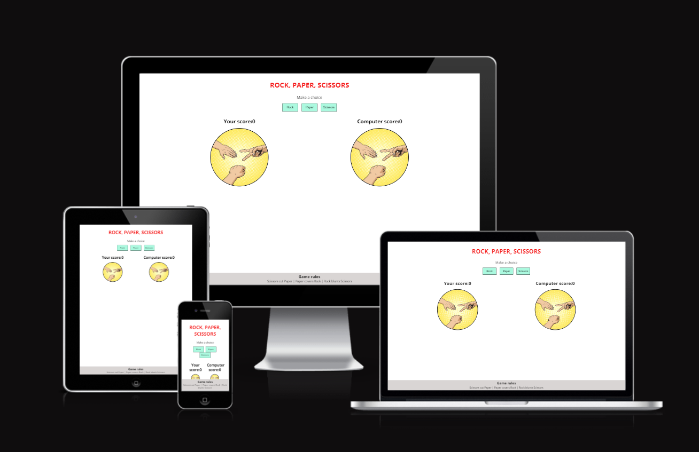
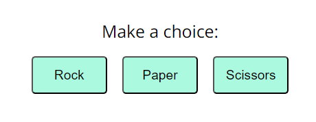
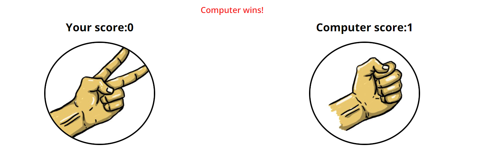
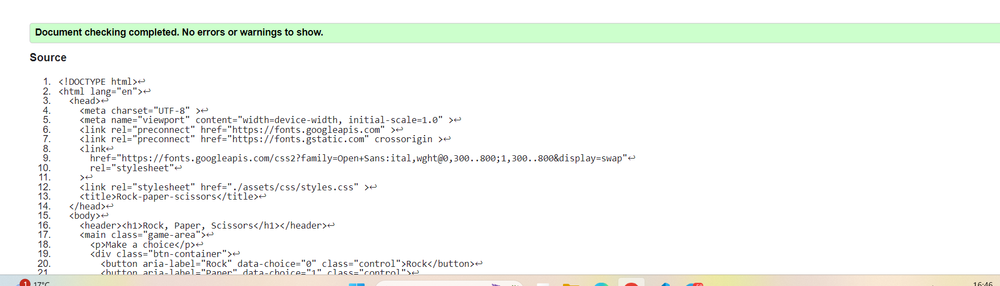
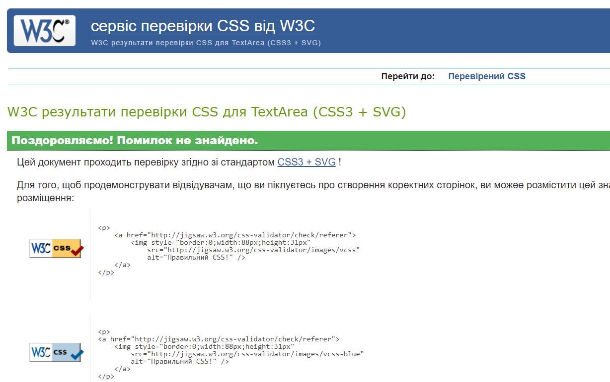
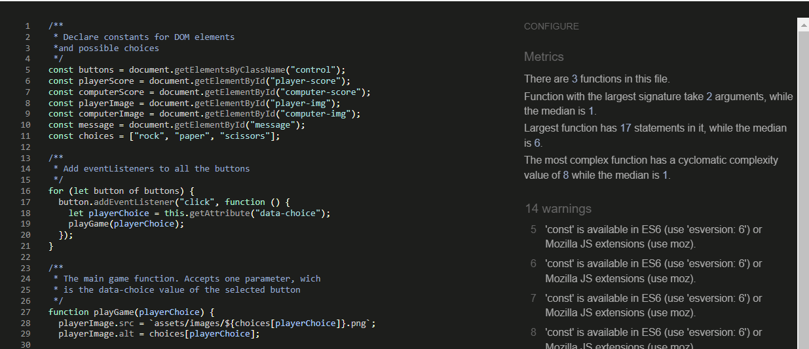
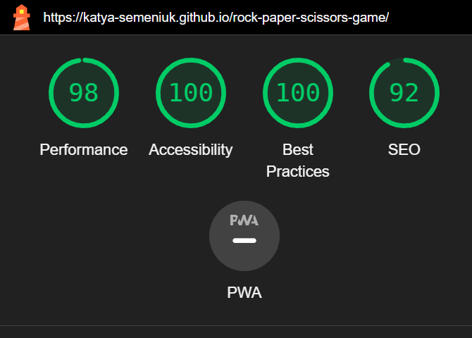

# Rock-Paper-Scissors game

is an exciting game that almost everyone has known since childhood. If you find yourself in a situation where there is no one around to play Rock, Paper, Scissors with you, then this is the moment when you need to open this game and play with a virtual partner, i.e. a computer.
All you need to do is select the Stone, Scissors, or Paper you want to play for each game by clicking on the button with the appropriate name. And the winner will be displayed on the screen and points will be counted.

## Features

- ### Header:

The name of the game is indicated at the very top - Stone, Scissors, Paper. So users immediately understand what game they are going to play.

- ### The game options:
  The user has 3 options to choose from - stone, scissors, or paper, which are presented in the form of interactive buttons.
  This section allows you to easily make a choice by clicking on the appropriate button.

- ### The game results:

When the user clicks on the selection button, the game starts and a picture is displayed on the user's side showing the selected choice.
The java script then selects a random option for the computer and displays the corresponding image on the screen as well.
The next step is to work out the logic of the choices and select the winner.

- ### Footer:

The liner contains the rules of the game.
A concise explanation of who is the winner among the possible combinations is always shown in the footer for your convenience.

## Features Left to Implement

I would add a popup with a timer.
If 5 minutes have passed since the last choice, politely remind the user to make a choice and continue the game.

## Technologies and Tools

_The following technologies were used to create this project:_

1. HTML;
2. CSS;
3. Lava Script.

_The following tools helped to develop this project:_

1. Code editor VSC;
2. Googl Chrome Dev Tools;
3. [Google Fonts](https://fonts.google.com/) for importing the font families used.;
4. Github - for version control;

## Testing

I tested the game on my phone and laptop and the winner and points were always correct.

- HTML
  No errors were returned when passing through the official [W3C validator](https://validator.w3.org/#validate_by_input)
  

- CSS
  No errors were found when passing through the official [(Jigsaw) validator](https://jigsaw.w3.org/css-validator/#validate_by_input)
  

  - JS
    No errors were found when passing through the official [JSHint JavaScript Validator](https://jshint.com/)
    

- Lighthouse
  Lighthouse from the Chrome Developer tools was used to test the performance, accessibility, best practices and SEO of each page on the website.
  

## Deployment

The site was deployed to GitHub pages.

The live link can be found [here](https://katya-semeniuk.github.io/rock-paper-scissors-game/)

To deploy on Github pages, the following steps can be taken:

Log in to GitHub and locate the GitHub Repository

1. Go to the settings tab
2. Go to the GitHub Pages section
3. Go to the Source section and select the Master Branch
4. Once the page has refreshed, scroll back down to the GitHub Pages section to locate the now published site link.

To fork the repository:

1. Log in to GitHub and locate the GitHub Repository
2. At the top of the Repository, on the right side of the page, select "Fork"
3. You should now have a copy of the original repository in your GitHub account, and you can deploy it to GitHub pages following the steps above.

## Credits

The pictures of Rock Paper Scissors were taken from [The Official Rules of Rock Paper Scissors](https://wrpsa.com/the-official-rules-of-rock-paper-scissors/)

The screensaver picturewere taken from [Googl Pictures](https://www.google.com/search?q=rock+paper+scissors&tbm=isch&ved=2ahUKEwit2_-E0faEAxWqk_0HHaHMBDEQ2-cCegQIABAA&oq=rock+paper+scissors&gs_lp=EgNpbWciE3JvY2sgcGFwZXIgc2Npc3NvcnMyBBAjGCcyBBAjGCcyBRAAGIAEMgYQABgHGB4yBhAAGAcYHjIGEAAYBxgeMgYQABgHGB4yBhAAGAcYHjIGEAAYBxgeMgYQABgHGB5IkQhQAFgAcAB4AJABAJgBpAGgAaQBqgEDMC4xuAEMyAEAigILZ3dzLXdpei1pbWeIBgE&sclient=img&ei=6W_0Ze3CC6qn9u8PoZmTiAM&bih=730&biw=1519&prmd=ivnbz&hl=uk)

---
